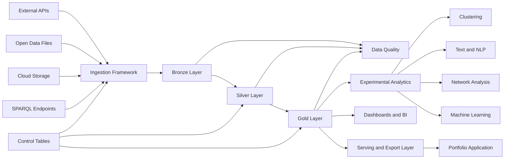

# Experimental Lakehouse Platform

A reusable cloud-based lakehouse platform for ingesting, transforming, validating and exploring open, experimental and niche datasets.

The primary goal of this project is to build the data platform itself.

Individual datasets, analyses and machine learning experiments are implemented as extensions of the platform rather than isolated projects.

## Project vision

Many data projects begin with a notebook and a single dataset. This project takes the opposite approach.

It first establishes a reusable lakehouse architecture that can support multiple data sources and analytical use cases. New APIs and datasets should be connectable without rebuilding the complete pipeline.

The platform is intended for datasets related to areas such as:

* computational humanities
* cultural heritage
* literature and art
* digital archives
* open government data
* historical records
* knowledge graphs
* language and text
* geography and society
* experimental public datasets

The first implementation targets Databricks, Delta Lake and PySpark. The architectural principles are designed to remain transferable to other lakehouse platforms, including Microsoft Fabric.

## Objectives

The platform should:

* ingest data from external APIs and cloud-based sources
* preserve raw source data
* produce normalized and reusable domain tables
* create analysis-ready data products
* support both batch and incremental ingestion
* track pipeline executions and ingestion state
* validate data quality
* isolate stable pipelines from experimental analysis
* support multiple unrelated datasets
* export selected results to dashboards and portfolio applications

## Architecture



## Medallion architecture

### Bronze layer

The Bronze layer stores source data in its original or near-original representation.

Possible formats include:

* JSON
* JSON-LD
* CSV
* XML
* Parquet
* raw API responses

Each ingestion batch should include technical metadata such as:

| Field                | Description                         |
| -------------------- | ----------------------------------- |
| `source_name`        | Name of the source system           |
| `source_endpoint`    | API endpoint or file location       |
| `ingested_at`        | Ingestion timestamp                 |
| `batch_id`           | Unique pipeline batch               |
| `request_parameters` | Parameters used for the request     |
| `http_status`        | HTTP response status                |
| `source_record_id`   | Identifier from the source          |
| `raw_payload`        | Original source payload             |
| `schema_version`     | Detected or assigned schema version |

Bronze data should be append-oriented whenever possible. Raw records should remain available for traceability and reprocessing.

### Silver layer

The Silver layer contains validated, normalized and reusable data.

Typical Silver operations include:

* schema enforcement
* type conversion
* flattening nested structures
* deduplication
* date standardization
* identifier normalization
* null handling
* category normalization
* entity resolution
* relationship extraction
* integration of multiple sources

Silver tables should represent reusable domain entities rather than individual reports.

Example entities include:

* works
* persons
* organisations
* locations
* subjects
* events
* collections
* relationships

### Gold layer

The Gold layer contains data products created for specific analytical or presentation needs.

Examples include:

* aggregated statistics
* reporting tables
* feature tables
* semantic models
* graph datasets
* clustering inputs
* embedding tables
* time series
* portfolio exports
* dashboard datasets

Gold tables may be rebuilt from Silver data without requesting the original API again.

## Platform components

### 1. Source registry

A source registry describes each connected data source.

Example configuration:

```yaml
source_name: example_api
source_type: rest
base_url: https://api.example.org
endpoint: /records
response_format: json

authentication:
  type: none

pagination:
  type: page_number
  page_parameter: page
  page_size_parameter: limit
  page_size: 100

incremental:
  enabled: true
  strategy: updated_at
  watermark_column: modified_at

destination:
  bronze_table: bronze.example_api_records
```

The long-term goal is to make source onboarding configuration-driven rather than notebook-driven.

### 2. Ingestion framework

The ingestion framework is responsible for:

* API requests
* authentication
* pagination
* rate limiting
* retries
* timeout handling
* incremental watermarks
* batch identifiers
* raw data persistence
* ingestion logging
* error handling

Source-specific parsing should be separated from generic ingestion logic.

### 3. Control tables

Control tables store operational state.

Suggested tables:

#### `platform.source_registry`

Stores registered sources and their configuration.

#### `platform.pipeline_runs`

Stores one record per pipeline execution.

#### `platform.ingestion_state`

Stores the latest successfully processed watermark or cursor.

#### `platform.schema_history`

Stores detected schema versions and schema changes.

#### `platform.data_quality_results`

Stores the result of data quality checks.

#### `platform.failed_records`

Stores records that could not be processed.

Example pipeline run fields:

```text
run_id
pipeline_name
source_name
started_at
completed_at
status
records_read
records_written
records_rejected
error_message
```

### 4. Data quality framework

Data quality is treated as part of the pipeline rather than a final manual check.

Potential checks include:

* required columns
* unique identifiers
* valid data types
* accepted value ranges
* duplicate rates
* null rates
* referential integrity
* date validity
* unexpected schema changes
* unexpected volume changes

Checks should produce persistent results that can be compared between pipeline runs.

### 5. Transformation framework

Transformations are divided into two levels:

```text
Bronze → Silver
```

Creates cleaned and reusable domain entities.

```text
Silver → Gold
```

Creates use-case-specific data products.

Transformation logic should be:

* version controlled
* idempotent where possible
* testable
* independent from notebook state
* separated from ingestion logic

### 6. Experimental workspace

The experimental workspace is designed for exploratory work using stable Silver and Gold data.

Possible experiments include:

* K-means clustering
* HDBSCAN
* PCA
* UMAP
* text embeddings
* topic modelling
* network analysis
* anomaly detection
* geographical analysis
* historical trend analysis

Experiments must not modify production Bronze or Silver tables directly.

Successful experiments may later be promoted into reproducible Gold pipelines.

### 7. Serving and export layer

The platform should support several ways of exposing results:

* Databricks SQL
* dashboards
* Power BI
* materialized Gold tables
* JSON exports
* CSV exports
* Parquet exports
* a future backend API
* a portfolio website

A public portfolio should normally consume small Gold exports or cached API responses rather than query the full lakehouse on every page load.

## Repository structure

```text
experimental-lakehouse/
│
├── README.md
├── pyproject.toml
├── requirements.txt
│
├── config/
│   ├── environments/
│   ├── sources/
│   └── quality/
│
├── src/
│   ├── ingestion/
│   │   ├── clients/
│   │   ├── pagination/
│   │   ├── authentication/
│   │   └── ingestion_runner.py
│   │
│   ├── transformations/
│   │   ├── bronze_to_silver/
│   │   └── silver_to_gold/
│   │
│   ├── schemas/
│   │   ├── bronze/
│   │   ├── silver/
│   │   └── gold/
│   │
│   ├── quality/
│   ├── metadata/
│   ├── logging/
│   └── exports/
│
├── notebooks/
│   ├── setup/
│   ├── ingestion/
│   ├── transformations/
│   └── experiments/
│
├── pipelines/
│   ├── ingestion/
│   ├── transformations/
│   └── orchestration/
│
├── tests/
│   ├── unit/
│   ├── integration/
│   └── data_quality/
│
├── datasets/
│   ├── example_source/
│   └── future_sources/
│
├── docs/
│   ├── architecture/
│   ├── data_models/
│   ├── decisions/
│   └── runbooks/
│
└── exports/
    ├── json/
    ├── charts/
    └── portfolio/
```

## Suggested catalog structure

```text
experimental_lakehouse
├── platform
│   ├── source_registry
│   ├── pipeline_runs
│   ├── ingestion_state
│   ├── schema_history
│   ├── data_quality_results
│   └── failed_records
│
├── bronze
│   └── source_name_raw
│
├── silver
│   ├── entities
│   └── relationships
│
├── gold
│   ├── analytics
│   ├── machine_learning
│   └── portfolio
│
└── sandbox
    └── experiments
```

Depending on the environment, Bronze, Silver and Gold may instead be implemented as separate catalogs.

## Initial implementation plan

### Phase 1: Platform foundation

* create the repository structure
* configure the Databricks workspace
* create catalogs and schemas
* create control tables
* define logging conventions
* define naming conventions
* create the first pipeline run model
* create a generic source configuration format

### Phase 2: Generic ingestion

* implement a REST API client
* implement pagination
* implement retry logic
* implement rate limiting
* generate batch identifiers
* store raw payloads in Bronze
* write ingestion results to control tables
* preserve failed records

### Phase 3: Transformation framework

* create reusable Bronze-to-Silver helpers
* enforce schemas
* normalize nested JSON
* implement deduplication
* create reusable entity and relationship patterns
* create Silver-to-Gold transformation examples

### Phase 4: Data quality

* create configurable quality checks
* store quality results
* define warning and failure thresholds
* detect unexpected schema changes
* detect unexpected volume changes

### Phase 5: Demonstration source

Connect one small public API to validate the architecture.

The first source should remain intentionally limited. Its purpose is to prove that the platform works, not to define the entire project.

### Phase 6: Experimental datasets

Add separate datasets and analytical projects without changing the platform foundation.

Potential examples:

* cultural heritage metadata
* bibliographic records
* historical people and places
* public art collections
* computational humanities corpora
* social and geographical datasets
* niche scientific datasets
* unusual public APIs

## Definition of done for the platform MVP

The first platform version is complete when:

* one external API can be registered through configuration
* the API can be ingested into Bronze
* ingestion metadata is recorded
* failed requests can be retried
* Bronze data can be transformed into Silver
* at least one Gold data product is created
* data quality checks are persisted
* the pipeline can be rerun without corrupting data
* a second source can be added without redesigning the architecture
* the complete data flow is documented

## Design principles

### Platform first

The architecture should not be tightly coupled to the first dataset.

### Raw data is preserved

It should always be possible to reconstruct Silver and Gold from Bronze.

### Metadata is data

Pipeline status, source information, quality results and schema history are stored as structured data.

### Configuration over duplication

New sources should reuse generic ingestion components wherever possible.

### Experiments are isolated

Exploratory analysis should not compromise the stable data layers.

### Gold represents data products

Gold tables should have a defined consumer or analytical purpose.

### Reproducibility over manual work

Important transformations should eventually move from exploratory notebooks into version-controlled pipelines.

## Future development

Possible future extensions include:

* scheduled ingestion
* event-driven ingestion
* streaming sources
* change data capture
* automated schema evolution
* lineage visualisation
* data contracts
* CI/CD
* environment-specific deployments
* infrastructure as code
* model tracking
* vector search
* knowledge graph generation
* a public portfolio API
* a Next.js data portfolio

## Status

The project is currently focused on establishing the reusable lakehouse foundation.

Dataset-specific analysis will be added incrementally after the core ingestion, metadata, transformation and data quality components are operational.
